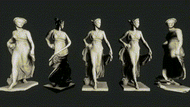

# ShaderLibraryCore


System Requirements
-------------------

- Unity 2021.1
- HDRP 11.0

Effects
-------

### Deformaion3D




1. 3D distortion with Simplex noise gradient 
2. Twist
3. Death Stranding Glitch
4. Spring light damping
5. MIDI twist

### Cyber Circuit

Circuit shader based on Minkowski Voronoi & wave shader


### Shader in Blender (Minkowski Voronoi & Wave) 

These are from Blender shader.


<table>
<tr>
	<th scope="Minkowski Voronoi">Minkowski Voronoi</th>
	<th scope="Wave">Wave</th>
</tr>
<tr>
<td></td>
<td></td>
</tr>
</table>


## How to install

Write a package path on manifest.json

```
"jp.supertask.shaderlibcore": "https://github.com/supertask/ShaderLibCore.git?path=/Packages/jp.supertask.shaderlibcore",
```


